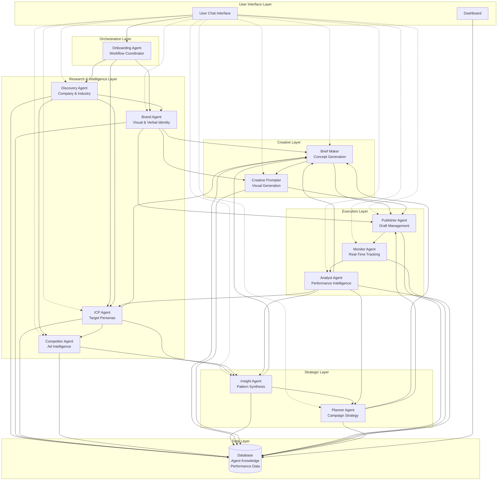
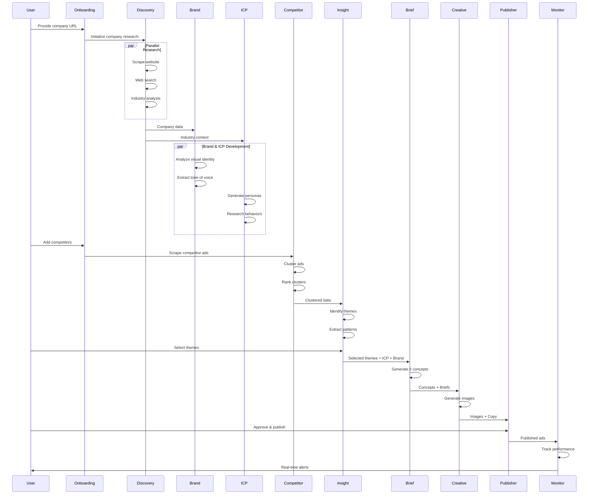
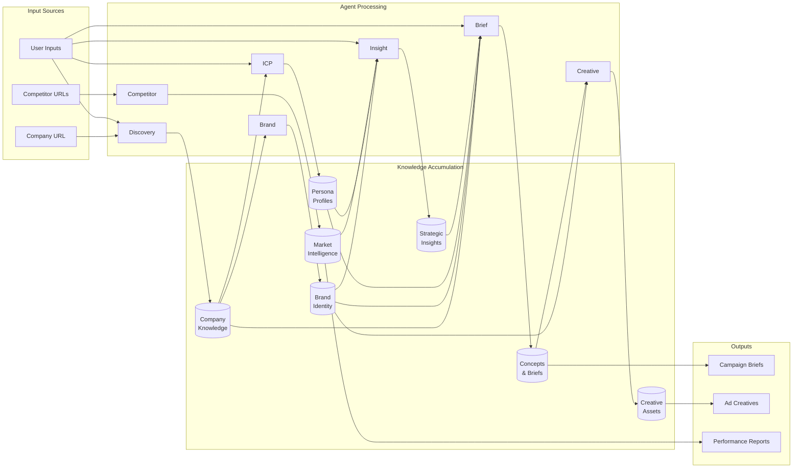
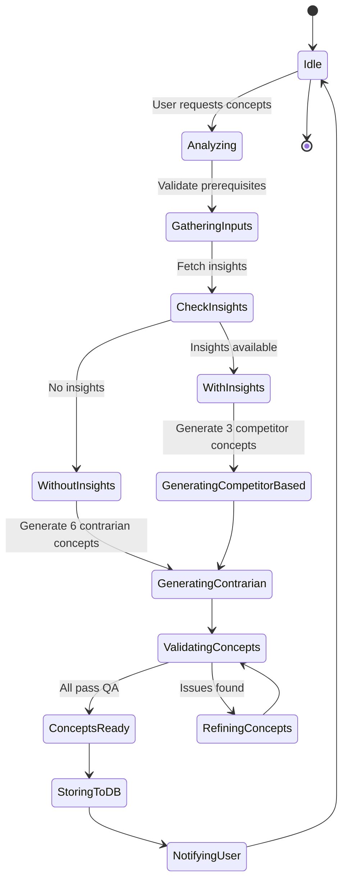
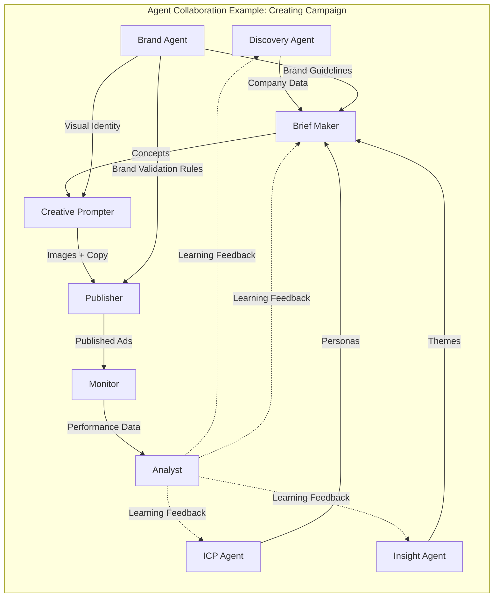

# ScaleFox Agent System Diagram

## System Architecture Visualization

## Agent Communication Flow

## Data Flow Architecture

## Agent State Machine (Example: Brief Maker)

## Agent Collaboration Pattern

## Database Schema Overview

```mermaid
erDiagram
    USERS ||--o{ COMPANIES : owns
    COMPANIES ||--o{ COMPETITORS : tracks
    COMPANIES ||--o{ PERSONAS : targets
    COMPANIES ||--o{ CAMPAIGNS : runs
    
    COMPETITORS ||--o{ COMPETITOR_ADS : has
    COMPETITOR_ADS ||--o{ AD_CLUSTERS : belongs_to
    
    AD_CLUSTERS ||--o{ INSIGHTS : generates
    INSIGHTS ||--o{ EFFECTIVE_THEMES : contains
    
    PERSONAS ||--o{ BRIEFS : targets
    EFFECTIVE_THEMES ||--o{ BRIEFS : informs
    COMPANIES ||--o{ BRIEFS : creates
    
    BRIEFS ||--o{ GENERATED_IMAGES : produces
    GENERATED_IMAGES ||--o{ DRAFTS : becomes
    
    DRAFTS ||--o{ PUBLISHED_ADS : publishes_as
    CAMPAIGNS ||--o{ PUBLISHED_ADS : contains
    
    PUBLISHED_ADS ||--o{ PERFORMANCE_METRICS : tracks
    
    USERS {
        uuid user_id PK
        string email
        jsonb preferences
        timestamp created_at
    }
    
    COMPANIES {
        uuid company_id PK
        uuid user_id FK
        jsonb company_profile
        jsonb brand_identity
        timestamp last_updated
    }
    
    PERSONAS {
        uuid persona_id PK
        uuid company_id FK
        string name
        jsonb demographics
        jsonb psychographics
        boolean selected
    }
    
    COMPETITORS {
        uuid competitor_id PK
        uuid company_id FK
        string name
        string url
        timestamp last_scraped
    }
    
    COMPETITOR_ADS {
        uuid ad_id PK
        uuid competitor_id FK
        jsonb ad_data
        uuid cluster_id FK
    }
    
    AD_CLUSTERS {
        uuid cluster_id PK
        int cluster_rank
        float cluster_score
        uuid best_ad_id FK
    }
    
    INSIGHTS {
        uuid insight_id PK
        uuid company_id FK
        jsonb effective_themes
        jsonb success_patterns
        timestamp generated_at
    }
    
    BRIEFS {
        uuid brief_id PK
        uuid company_id FK
        string concept_name
        jsonb ad_copy
        jsonb brief_data
        string status
    }
    
    GENERATED_IMAGES {
        uuid image_id PK
        uuid brief_id FK
        string image_url
        jsonb generation_params
    }
    
    DRAFTS {
        uuid draft_id PK
        uuid brief_id FK
        uuid image_id FK
        string status
        jsonb validation_result
    }
    
    CAMPAIGNS {
        uuid campaign_id PK
        uuid company_id FK
        string campaign_name
        jsonb campaign_config
    }
    
    PUBLISHED_ADS {
        uuid published_ad_id PK
        uuid draft_id FK
        uuid campaign_id FK
        string platform
        timestamp published_at
    }
    
    PERFORMANCE_METRICS {
        uuid metric_id PK
        uuid published_ad_id FK
        jsonb metrics
        timestamp recorded_at
    }
```

## Agent Interaction Matrix

| Agent | Sends Data To | Receives Data From | Collaboration Type |
|-------|---------------|-------------------|-------------------|
| **Discovery** | Brand, ICP, Competitor, Brief | Analyst | Sequential (Foundation) |
| **Brand** | Brief, Creative, Publisher | Discovery | Sequential + Validation |
| **ICP** | Competitor, Insight, Brief | Discovery, Analyst | Sequential + Feedback |
| **Competitor** | Insight | Discovery, ICP | Sequential |
| **Insight** | Brief, Planner | Competitor, ICP, Analyst | Synthesis |
| **Brief** | Creative, Publisher | Discovery, Brand, ICP, Insight, Analyst | Creation |
| **Creative** | Publisher | Brief, Brand | Creation |
| **Publisher** | Monitor | Creative, Brand | Execution |
| **Monitor** | Analyst | Publisher | Real-time |
| **Analyst** | All Agents | Monitor | Feedback Loop |
| **Planner** | Brief, Publisher | Insight, Analyst | Coordination |
| **Onboarding** | All Agents | All Agents | Orchestration |

---

*These diagrams provide a visual overview of how the ScaleFox agent system operates.*
